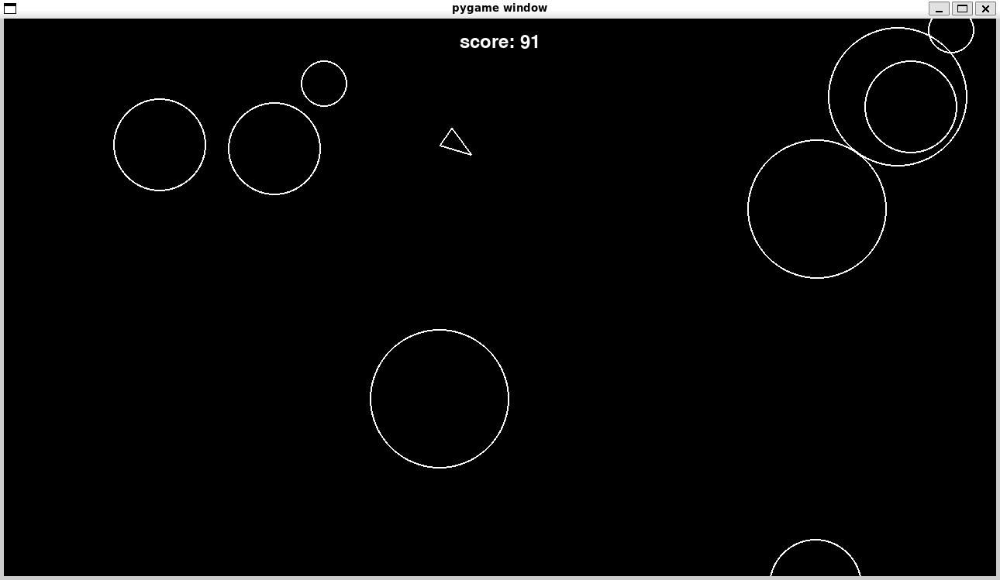

# Asteroid Project 🚀🌠

Hey people! 👋, so i built this asteroid game to practice OOP concept in python as my first step in learning Backend with python.

## Key Features: 💯
- I created different classes and their groups to practice OOP strucure like asteroid/player/asteroidfeild.
- Detects collision (player and asteroi) based on the distance anf the radius of two objects.
- used pygame for deep internal logic.

## Sample image:

## Goals:
- To showcase my progress. 💻
- To Practice contained concept of coding.
- To have fun ☻ .

## Contact:
rudrakshthakur60@gmail.com